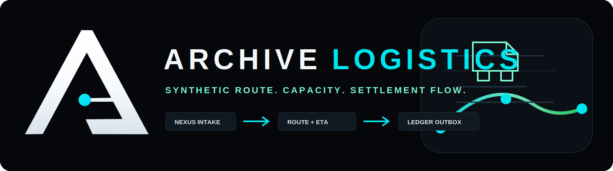

<p align="center">
  
</p>

# Archive-Logistics

Archive-Logistics는 Archive Platform Ecosystem에서 Nexus 출하 이벤트를 받아
합성(synthetic) 경로/ETA/운송비를 계산하고,
정상 흐름이면 Archive-Ledger로 비용 확정 이벤트를 발행하는 물류 백엔드입니다.

**외부 노출명은 항상 `Archive-Logistics`로 통일**합니다.  
`Archive-Logitics`, `logitics`는 일부 내부 field나 히스토리 호환성을 위해 남아 있습니다.

## 핵심 역할

- Archive-Nexus의 물류 이벤트 수신 (`/api/events/nexus*`)
- 합성 라우트 계산 및 route/cost 생성
- Outbox 기반 이벤트 적재와 배치 발행
- Ledger 이벤트 및 정산/비용 이벤트 발행
- 운영/건강 상태 요약, 감사 로그 기록
- Market-origin 메타데이터(orderId/customerType/expressOrder/riskLevel) 추적

## Core Flow

```text
Archive-Nexus
  -> Nexus Logistics Event
  -> Archive-Logistics Ingestion
     -> Duplicate Guard
     -> Workforce Capacity Check
     -> Synthetic Route / ETA / Cost Calculation
     -> Route Plan + Route Cost
     -> Logistics Economy Events
     -> Outbox
        -> Archive-Ledger Publish
        -> Retry / Failed / Skipped Isolation
     -> Daily Logistics Settlement
        -> Nexus Compensation Callback
```

| Stage | Input / State | Logistics Role | Output |
| --- | --- | --- | --- |
| `INGESTION` | Nexus 출하/물류 이벤트 | eventId/idempotencyKey 중복 방지 | `nexus_logistics_event` |
| `WORKFORCE` | synthetic role allocation | 배차, route, delivery, delay capacity 계산 | workday result, backlog, bottleneck |
| `ROUTE` | origin/destination synthetic code | deterministic matrix 기반 route/ETA 계산 | `route_plan` |
| `COST` | route, priority, cold-chain, risk | 운송비, surcharge, penalty 계산 | `route_cost` |
| `ECONOMY` | route/cost/workforce result | 수익/비용/payroll/backlog cost 기록 | logistics revenue/cost events |
| `OUTBOX` | Ledger-compatible payload | DB Outbox 저장, retry 상태 관리 | `logistics_outbox_event` |
| `LEDGER` | publishable outbox | Ledger 장애 격리, hop guard 적용 | cost confirmed events |
| `SETTLEMENT` | published logistics cost | Nexus 대상 일일 보상/청구 정산 | daily settlement callback |

Archive-Logistics는 Archive-Market과 직접 강결합하지 않습니다. Market-origin metadata는 Archive-Nexus가 전달한 payload 안에서만 추적하며, `orderId`, `correlationId`, `settlementCycleId` 기준으로 Ledger 정산 흐름까지 연결합니다.

## Ecosystem Flow

```text
Archive-Market
  -> demand / order / payment / claim events
  -> Archive-Nexus
     -> production / inventory / shipment events
     -> Archive-Logistics
        -> workforce capacity
        -> synthetic route / ETA / delivery cost
        -> delay / deviation / cold-chain risk
        -> logistics outbox
        -> Archive-Ledger
           -> transaction normalization
           -> ledger entries
           -> daily settlement
           -> reconciliation
        -> Nexus daily logistics settlement callback
  -> ArchiveOS
     -> ecosystem health
     -> workforce bottleneck
     -> cashflow / bankruptcy risk
     -> approval / safe-mode control
```

| Service | Logistics 관점의 연결 | 주요 데이터 |
| --- | --- | --- |
| `Archive-Market` | 직접 호출하지 않고 Nexus payload metadata로 추적 | `orderId`, `customerType`, `productType`, `orderAmount`, `correlationId` |
| `Archive-Nexus` | 물류 이벤트 입력 source, 일일 정산 callback 대상 | `LOGISTICS_DISPATCHED`, `URGENT_DELIVERY_REQUESTED`, `SHIPMENT_HOLD_RELEASED` |
| `Archive-Logistics` | route/ETA/cost/workforce/outbox 책임 서비스 | `route_plan`, `route_cost`, `workday_result`, `logistics_outbox_event` |
| `Archive-Ledger` | 비용 확정/정산/대사 이벤트 발행 대상 | `LOGISTICS_COST_CONFIRMED`, `DELAY_PENALTY_CONFIRMED`, `COLD_CHAIN_RISK_COST_CONFIRMED` |
| `ArchiveOS` | 운영 관제와 safe-mode 판단 주체 | health, operations summary, workforce bottleneck, economy risk |

```text
Commercial Flow:
Market order -> Nexus shipment -> Logistics delivery cost -> Ledger settlement -> OS control tower

Operational Flow:
OS/Market workforce allocation -> Logistics workday run -> capacity/backlog/productivity -> OS summary

Financial Flow:
Logistics fee/revenue -> Ledger cost confirmation -> daily settlement/reconciliation -> Nexus compensation callback
```

## 운영 API

### 상태/요약

- `GET /actuator/health`
- `GET /api/operations/summary`
- `GET /api/routes/summary`
- `GET /api/routes/summary?factoryId={factoryId}`
- `GET /api/routes/summary?date=YYYY-MM-DD`
- `GET /api/routes/summary?factoryId={factoryId}&date=YYYY-MM-DD`
- `GET /api/outbox/summary`
- `GET /api/logistics-economy/summary`
- `GET /api/logistics-economy/revenue-events`
- `GET /api/logistics-economy/cost-events`
- `GET /api/logistics-economy/profit-snapshots`
- `GET /api/logistics-settlements`
- `GET /api/logistics-settlements/summary`
- `GET /api/workforce/summary`
- `GET /api/productivity/summary`
- `GET /api/capacity/summary`
- `GET /api/runtime-events/recent?limit=100`
- `GET /api/runtime-events/correlation/{correlationId}`
- `GET /api/runtime-events/entity/{entityId}`
- `GET /api/runtime/status`

### 이벤트 수신/시뮬레이션

- `POST /api/events/nexus`
- `POST /api/events/nexus/bulk`
- `POST /api/simulations/shipments?count=100`

### 출고/정산 API

- `POST /api/logistics-settlements/daily/run?date=YYYY-MM-DD`
- `GET /api/logistics-settlements/{settlementId}`
- `POST /api/workforce/allocations`
- `POST /api/workforce/workday/run?date=YYYY-MM-DD`

### Outbox/API Publish

- `GET /api/outbox/events`
- `GET /api/outbox/events/{eventId}`
- `POST /api/outbox/publish`
- `POST /api/outbox/retry-failed`
- `POST /api/batch/outbox-publish/run`
- `GET /api/batch/jobs`
- `GET /api/batch/jobs/{executionId}`

### Nexus 보조 정산(레거시)

- `POST /api/settlements/nexus-daily/run`
- `GET /api/settlements/nexus-daily/summary`
- `GET /api/settlements/nexus-daily/{settlementId}`
- `POST /api/batch/nexus-daily-settlement/run`

## 아웃박스/Batch 동작

- Outbox 상태: `PENDING`, `PUBLISHED`, `FAILED`, `RETRY`, `SKIPPED`
- Ledger 미연동(`ARCHIVE_LEDGER_ENABLED=false`) 시 publish는 `DRY_RUN/SKIPPED`
- 실패 이벤트는 `retry_count`, `last_error`, `next_retry_at`를 기록해 재시도

스케줄러는 `ARCHIVE_OUTBOX_SCHEDULER_ENABLED=true`일 때만 동작합니다.
로컬 default는 수동 또는 제한된 구간에서 운영 테스트를 권장합니다.

## 합성 데이터 정책

- 실제 지도 API, 실제 차량/주소/배송/개인정보는 사용하지 않습니다.
- Factory/도착지/벤더 코드는 전부 synthetic 값입니다.
- route 계산은 deterministic matrix/hash 기반입니다.

## Operational Workforce

Archive-Logistics는 synthetic dispatcher/driver/delay responder 배정에 따라
일별 capacity, backlog, bottleneck, productivity, synthetic labor cost를 계산합니다.
`ARCHIVE_WORKFORCE_ENABLED=false`이면 기존 baseline capacity로 동작하므로 기존 이벤트 처리 흐름은 유지됩니다.
역할은 `DISPATCH_PLANNER`, `ROUTE_PLANNER`, `DELIVERY_DRIVER`, `DELAY_RESPONSE_OPERATOR`,
`COLD_CHAIN_HANDLER`, `LOGISTICS_MANAGER`를 지원합니다.

Workforce 조회 API는 ArchiveOS Workforce Overview가 read-only로 수집하는 계약입니다.
`GET /api/workforce/summary`, `GET /api/productivity/summary`, `GET /api/capacity/summary`는
summary 조회 중 seed, simulation, outbox publish, DB insert를 수행하지 않습니다.
저장된 workday 결과가 없어도 현재 synthetic workload count와 baseline/default 값으로 HTTP 200 응답을 반환합니다.

## ArchiveOS Live Flow

ArchiveOS는 Archive-Logistics의 배송 흐름을 read-only runtime event projection으로 수집합니다.
`/api/runtime-events/*`는 저장된 Nexus event, route plan, route cost, outbox, workforce/workday 결과만 변환하며,
화면용 random truck/token 데이터나 실제 주소 데이터를 만들지 않습니다.

대표 이벤트는 `SHIPMENT_CREATED`, `ROUTE_ASSIGNED`, `ROUTE_COST_CALCULATED`, `TRUCK_DISPATCHED`,
`DELIVERY_DELAYED`, `DELIVERY_COMPLETED`, `LOGISTICS_COST_CONFIRMED`, `LEDGER_EVENT_PUBLISHED`,
`WORKFORCE_ALLOCATION_ASSIGNED`, `WORKDAY_COMPLETED`, `CAPACITY_SHORTAGE_DETECTED`,
`LOGISTICS_BACKLOG_INCREASED`입니다.

세부 계약은 `docs/archiveos-live-flow-contract.md`,
`docs/logistics-runtime-event-contract.md`,
`docs/logistics-delay-capacity-contract.md`를 기준으로 합니다.

## Autonomous Runtime Work Loop

local/demo 환경에서는 `archive.runtime.autorun.enabled=true`로 제한된 synthetic runtime work loop를 실행할 수 있습니다.
기본 tick 간격은 `30s`이고 tick당 최대 `10`건의 Nexus-origin synthetic shipment event만 생성합니다.
outbox backlog가 `archive.runtime.max-backlog-per-tick` 이상이면 신규 shipment 생성을 멈추고 workday/capacity tick만 갱신합니다.

상태 확인:

```http
GET /api/runtime/status
```

주요 설정:

- `ARCHIVE_RUNTIME_AUTORUN_ENABLED`
- `ARCHIVE_RUNTIME_TICK_INTERVAL`
- `ARCHIVE_RUNTIME_INITIAL_DELAY`
- `ARCHIVE_RUNTIME_MAX_EVENTS_PER_TICK`
- `ARCHIVE_RUNTIME_MAX_BACKLOG_PER_TICK`

GET summary API는 계속 read-only입니다. 자동 루프의 write는 scheduler tick에서만 수행되고,
eventId/idempotencyKey/correlationId/hop guard와 per-tick limit으로 이벤트 폭증을 막습니다.

## Internationalization

- 웹 관제 화면은 한국어(`ko`), English(`en`), 日本語(`ja`), 简体中文(`zh-CN`)을 지원합니다.
- 우측 상단 지구본 메뉴에서 즉시 언어를 전환할 수 있습니다.
- 선택 언어는 `localStorage`의 `archive.locale` key에 저장되어 새로고침 후에도 유지됩니다.
- API path, eventType, enum, traceId, correlationId 같은 시스템 식별자는 번역하지 않고 UI label만 번역합니다.
- 일부 내부 호환 key와 source literal에는 기존 계약 유지를 위해 `Archive-Logitics` / `logitics` 표기가 남을 수 있습니다.

## `/api/routes/summary` 500 이슈

`factoryId`, `date` 쿼리 조합에서 발생하던 `could not determine data type` 이슈는
`summary` 조회를 경로별 분기 처리(조건별 쿼리)로 완전 해결했습니다.
아래 조합은 모두 200입니다.

- `GET /api/routes/summary`
- `GET /api/routes/summary?factoryId=FAC-A`
- `GET /api/routes/summary?date=YYYY-MM-DD`
- `GET /api/routes/summary?factoryId=FAC-A&date=YYYY-MM-DD`

## 로컬 실행

```bash
cp .env.example .env   # 선택
docker compose up --build
```

또는

```bash
./gradlew.bat bootRun
```

기본 포트: `8092`

권장 환경변수:

- `SPRING_PROFILES_ACTIVE=local`
- `ARCHIVE_LEDGER_ENABLED=true` (Ledger 실서비스 연동 시)
- `ARCHIVE_LEDGER_BASE_URL=http://localhost:18080` 또는 `host.docker.internal:18080`
- `ARCHIVE_NEXUS_SETTLEMENT_ENABLED=true`

## Smoke 체크

```powershell
curl.exe http://localhost:8092/actuator/health
curl.exe http://localhost:8092/api/operations/summary
curl.exe http://localhost:8092/api/routes/summary
curl.exe "http://localhost:8092/api/routes/summary?factoryId=FAC-A"
curl.exe "http://localhost:8092/api/routes/summary?date=2026-01-15"
curl.exe "http://localhost:8092/api/routes/summary?factoryId=FAC-A&date=2026-01-15"
curl.exe http://localhost:8092/api/outbox/summary
curl.exe -X POST "http://localhost:8092/api/simulations/shipments?count=100"
curl.exe -X POST "http://localhost:8092/api/outbox/publish"
curl.exe -X POST "http://localhost:8092/api/logistics-settlements/daily/run?date=2026-01-15"
curl.exe http://localhost:8092/api/logistics-economy/summary
```

## 문서

- [Architecture](./docs/architecture.md)
- [Event Contract](./docs/event-contract.md)
- [API Reference](./docs/api-reference.md)
- [Route Summary Fix](./docs/routes-summary-fix.md)
- [Outbox Batch Publisher](./docs/outbox-batch-publisher.md)
- [Ledger Integration](./docs/ledger-integration.md)
- [Nexus Daily Settlement](./docs/nexus-daily-settlement.md)
- [Logistics Economy Model](./docs/logistics-economy-model.md)
- [Logistics Economy Daily Settlement](./docs/logistics-daily-settlement.md)
- [Market Origin Metadata](./docs/market-origin-logistics-metadata.md)
- [Logistics Workforce Model](./docs/logistics-workforce-model.md)
- [Logistics Productivity Model](./docs/logistics-productivity-model.md)
- [Workforce Event Contract](./docs/workforce-event-contract.md)
- [ArchiveOS Live Flow Contract](./docs/archiveos-live-flow-contract.md)
- [Runtime Event Contract](./docs/runtime-event-contract.md)
- [Operations Summary Contract](./docs/operations-summary-contract.md)
- [Game Economy Economics Notes](./docs/game-economy-logistics.md)
- [Operations Runbook](./docs/operations-runbook.md)
- [OCI Lite Profile](./docs/oci-lite-profile.md)
- [API Examples](./docs/api-examples.http)
- [Smoke Result](./docs/final-smoke-result.md)
